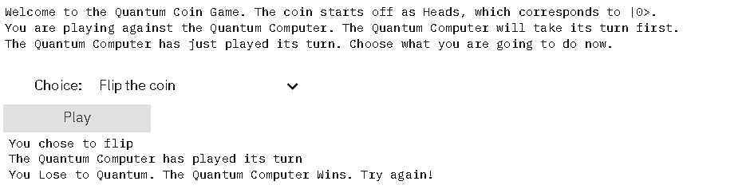

## Welcome to IBM Quantum Challenge | QC Hack 2022
## QUANTUM COIN FLIP
[Ananya Shukla](https://github.com/ShuklaAnanya)
Email: shukla_ananya@outlook.com
-------------------------------------------------------------

 

## DESCRIPTION
The game we will be quantizing today is none other than the infamous Coin Flip! Here, "Quantizing" a game simply means introducing quantum effect into the game. 
Play this game on Qiskit to try your luck against a Quantum Computer

## CODE
-------------------------------------------------------------

# Importing all the necessary library
from qiskit.tools.jupyter import *
from qiskit.visualization import *
import qiskit.tools.jupyter #Repetition of line 1?
import ipywidgets as widgets

print("Welcome to the Quantum Coin Game. The coin starts off as Heads, which corresponds to |0>.")
print("You are playing against the Quantum Computer. The Quantum Computer will take its turn first.")
print("The Quantum Computer has just played its turn. Choose what you are going to do now.")

# Layout
button = widgets.Button(
    description='Play')
player2_move = widgets.Dropdown(
    options=[('Do not flip the coin', 'Do Nothing'), ('Flip the coin', 'Apply X gate')],
    description='Choice: ',
    disabled=False,
)
out = widgets.Output()
def on_button_clicked(b):
    with out:
    
 #--------------------------------------------CODE FOR GAME STARTS HERE----------------------------------------------------------#       
        # Initial Circuit
        qc = QuantumCircuit(1, 1)
        
        # Turn 1
        qc.h(0)
        
        # Turn 2
        if player2_move.value == 'Do nothing':
            print('You chose to do nothing')
        if player2_move.value == 'Apply X gate':
            qc.x(0)
            print('You chose to flip')
        
        # Turn 3
        qc.h(0)
        print('The Quantum Computer has played its turn')
        # Measure  
        qc.measure(0,0)
        
        # QASM
        backend= Aer.get_backend('qasm_simulator')
        job = execute(qc, backend, shots=1)
        result = job.result()
        counts = result.get_counts()
        # Result
        if '0' in counts:
            print("You Lose to Quantum. The Quantum Computer Wins. Try again!")
        if '1' in counts:
            print("You Win against the Quantum Computer. Great job!")
            
 #--------------------------------------------CODE FOR GAME ENDS HERE----------------------------------------------------------# 
button.on_click(on_button_clicked)
widgets.VBox([player2_move, button, out])

## Sample Run

